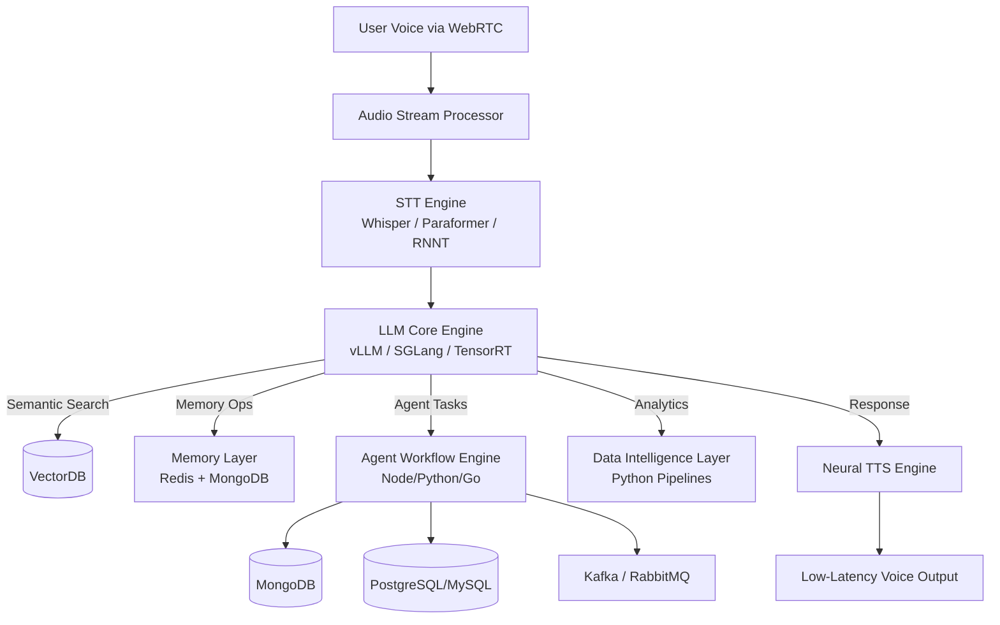

# **AI Agent Platform – Full-Stack Autonomous AI Assistant (Enterprise Foundation System)**

The **AI Agent Platform** is a high-performance, extensible, AI-native foundation designed for building **real-time, multimodal, agentic AI systems** at scale.
It merges **full-stack software engineering**, **AI/ML model customization**, **LLM orchestration**, **real-time audio intelligence**, and **cloud DevOps automation** into a unified, production-ready ecosystem that startups, engineering teams, and enterprise organizations can evolve into their own AI product infrastructure.

The platform captures **live human speech**, converts it into structured tokens, routes it through a **custom-optimized LLM engine**, triggers **autonomous agent workflows**, executes business logic pipelines, and returns **low-latency neural speech output**, forming a continuous and intelligent **Human ↔ AI loop**.

---

# 🚀 **Platform Highlights**

* 🎤 **Real-Time Voice STT** – Whisper/Paraformer/RNNT with DSP noise suppression
* 🧠 **Custom LLM Stack** – Fine-tuned large models optimized for deep reasoning
* 🔊 **Neural TTS Engine** – Natural, expressive, multilingual voice output
* 📚 **RAG + Memory System** – Hybrid vector + graph memory with semantic grounding
* 🤖 **Agentic Workflow Engine** – Tool execution, planning, multi-step reasoning
* 🌐 **MERN + TypeScript Stack** – End-to-end type-safe development
* 🕸️ **WebRTC + WebSockets** – Real-time audio transport & event streaming
* ⚙️ **Service-Oriented Architecture** – Decoupled AI microservices
* 📦 **GPU-Ready Dockerized Deployment** – CUDA, Triton, TensorRT support
* ☁️ **Cloud-Agnostic Scaling** – AWS / GCP / Azure autoscaling environments
* 🔐 **Security & Governance** – JWT, OAuth2, RBAC, API gateway policies

---

# 🛠️ **Technology Stack**

## **Full-Stack Application Layer**

| Component                                         | Purpose                                                 |
| ------------------------------------------------- | ------------------------------------------------------- |
| **MongoDB + Redis**                               | Primary storage, caching, session states, rate limiting |
| **VectorDB (Pinecone, Qdrant, Weaviate, Milvus)** | Embeddings, semantic memory, RAG                        |
| **Express.js / NestJS / Node.js**                 | API gateway, routing, middleware, orchestration         |
| **React + Tailwind + Zustand**                    | Frontend UI, animations, state management               |
| **WebSockets / WebRTC**                           | Live voice, streaming text, server events               |
| **Kafka / RabbitMQ**                              | Event-driven async processing & agent triggers          |

---

# 🤖 **AI & Model Engineering Layer**

* **Custom Fine-Tuned LLMs** – Mixtral, Llama, Mistral, Qwen, Gemma
* **STT Pipelines** – Whisper large-v3, RNNT, Paraformer
* **TTS Engines** – Glow-TTS, FastPitch, Bark, neural voice cloning
* **ONNX Runtime / TensorRT / CUDA** – Hardware-accelerated inference
* **RAG Frameworks** – LangChain, LlamaIndex, RAG Fusion models
* **Embeddings Models** – BGE, E5, InstructorXL, text-embedding-3-large
* **Python + FastAPI Microservices** – High-load ML workloads
* **Agent Framework** – Tool calling, long-term memory, stateful tasks
* **vLLM / SGLang / Triton Inference Server** – High-throughput model serving

---

# 📊 **Data Engineering & Intelligence Layer**

* **Pandas / NumPy / SciPy** – Numerical computation
* **Polars** – High-performance data pipelines
* **Plotly / Matplotlib / ECharts** – Interactive analytics
* **Arrow / Parquet** – Efficient data formats
* **Auto-Insights Generator** – LLM-powered data storytelling & dashboards

---

# 🧩 **System Architecture (Enterprise Grade)**

---

# 🚀 **Deployment Architecture**

## **Containerization & Microservices**

* Fully containerized pipelines
* GPU-enabled inference (NVIDIA Docker + CUDA)
* Microservice mesh (Istio / Linkerd)
* Triton / vLLM inference pods
* Horizontal Pod Autoscaling (HPA)

---

## **Cloud-Native Infrastructure**

* **AWS EC2 / GCE / Azure NV-Series** – GPU compute
* **EKS / GKE / AKS** – Kubernetes orchestration
* **ECS Fargate** – Serverless containers
* **S3 / Cloud Storage** – Models, embeddings, logs
* **CDN (CloudFront)** – Low-latency global delivery
* **ALB / NLB Load Balancers** – Smart routing
* **Prometheus, Grafana, CloudWatch** – Telemetry pipelines

---

## **CI/CD & IaC**

* GitHub Actions / GitLab CI
* Automated test pipelines (unit, e2e, smoke tests)
* Zero-downtime deployments
* Terraform / Pulumi for Infrastructure as Code
* Canary, blue-green, feature-flag rollouts

---

# 👨‍💻 **Developer Responsibilities**

### **Full-Stack Engineering**

* REST, gRPC, GraphQL API development
* UI architecture (React/Tailwind/Framer)
* WebRTC + WebSockets integration
* Cross-database schema modeling

### **AI/ML Engineering**

* Fine-tuning + quantization
* Dataset building & preprocessing
* Prompt optimization & RAG pipelines
* CUDA/TensorRT inference optimizations
* Agent memory, reasoning graphs

### **DevOps & Infra**

* Docker + K8s with GPU scheduling
* Observability (ELK, OpenTelemetry)
* CI/CD automation
* Secrets management
* Zero-trust API gateway policies

---

# 📌 **Current Status**

The platform is delivered as a **fully modular, production-ready Autonomous AI Foundation** that is:

* scalable,
* cloud-native,
* agent-capable,
* customizable,
* and ready for enterprise adoption.

It serves as a powerful base for building **AI copilots**, **voice assistants**, **task automation agents**, **analytics bots**, **workflow engines**, and full-blown **autonomous AI products**.

---
