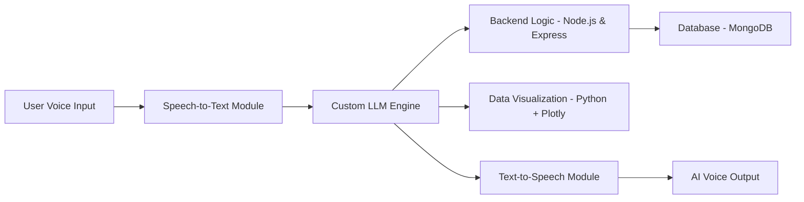

# 🧠 AI Agent – Personal AI Assistant (Under Development)

The **AI Agent** is a foundation-level project that combines **AI development** with **full-stack engineering (MERN)**.  
Its purpose is to serve as a **base model** that small startups or developers can adopt, extend, and evolve into their own products.  

This assistant listens to **user voice inputs**, converts them into text, processes them with a **custom Large Language Model (adapted from open-source and fine-tuned for specific requirements)**, and responds back in **natural speech** — enabling **real-time, conversational AI experiences**.  

---

## 🚀 Core Features
- 🎤 **Voice-to-Text** – Real-time speech transcription  
- 🧠 **Custom LLM Integration** – In-house adapted model for reasoning & dialogue  
- 🔊 **Text-to-Speech** – Natural, human-like responses  
- 📊 **Data Visualization** – Simple insights & charts from structured data  
- 🌐 **Full-Stack Support (MERN)** – Foundation for end-to-end product development  

---

## 🛠️ Core Tech Stack

### Full-Stack (MERN)
- **MongoDB** – Context & memory storage  
- **Express.js** – API gateway & orchestration  
- **React.js** – Interactive frontend  
- **Node.js** – Backend services  

### AI Development
- **Python / Go (and other languages)** – AI pipelines & model customization  
- **Custom LLM** – Fine-tuned from open-source foundation models  
- **Speech-to-Text** – Voice transcription (Whisper baseline or custom pipeline)  
- **Text-to-Speech** – Voice synthesis (gTTS or custom module)  

### Data Visualization
- **Pandas / NumPy** – Data handling & processing  
- **Matplotlib / Plotly** – Charts & visual insights  

### Deployment (Foundation-Level)
- **Docker** – Containerized environment  
- **Basic Cloud Setup (AWS / Any Cloud)** – Scalable setup for small-scale adoption  

---

## 🧩 Architecture Overview

---

## 🎯 Roadmap

* 🔐 Add simple authentication (JWT-based)
* 📱 Prototype mobile support (React Native)
* 🗣️ Multi-language voice support
* 📊 Enhanced data visualization modules
* 🧩 Further optimization of **custom lightweight LLM**

---

## 👨‍💻 Developer Role

* Full-stack development with **MERN**
* AI pipeline design with **Python / Go**
* Building and fine-tuning the **custom LLM**
* Designing a **scalable foundation architecture**
* Implementing the core **voice ↔ AI ↔ voice loop**

---

## 📌 Status

This project is **under active development**.
It is not a full enterprise solution but a **foundation-level AI assistant** that small startups or developers can **adopt, customize, and extend** for their own workflows.
